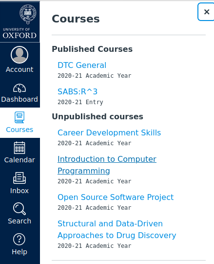
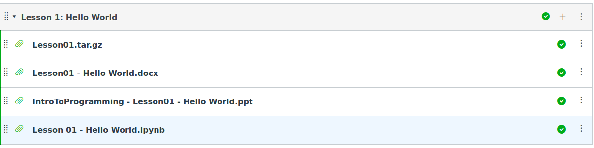
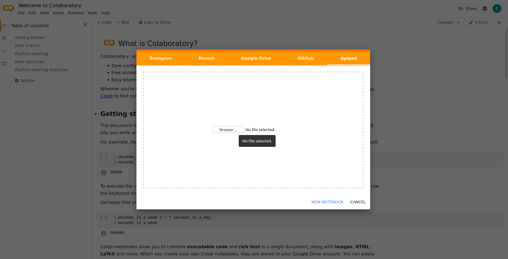
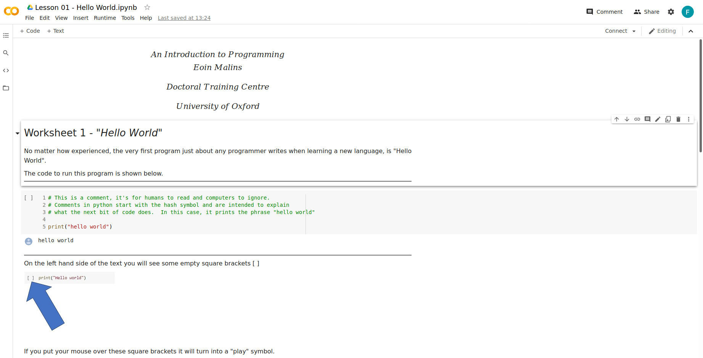

# Getting started with Google Colaboratory

First you'll need to download a notebook from Canvas. From the 'Courses' tooltip on Canvas, select 'Introduction to Computer Programming'. 

Scroll down until you find the lesson you need, in this case, Lesson 1: Hello World. Download 'Lesson 01 - Hello World.ipynb' - this is an ipython notebook file.

Next, you'll need to upload the notebook to your Google Drive so that you can use it it Colaboratory. If you navigate to colab.research.google.com you'll be prompted to select a notebook to use. Select 'Upload' to choose a notebook from your computer. Upload 'Lesson 01 - Hello World.ipynb'. It'll be saved to the folder 'Colab Notebooks' in your Google Drive. If the folder doesn't already exist, it will be created. In future, you can upload notebooks directly to this folder.

You should now see the notebook displayed in Colaboratory. The notebook consists of several 'cells' each of which contains a block of either Python or Markdown code. 

To run the contents of a cell, select the cell and press CTRL-ENTER. To run a cell and create a new, empty cell below, press SHIFT-ENTER. When you run a Markdown cell, the contents of the cell will be rendered in the notebook. When you run a Python cell, the output of the code will be displayed below the cell.